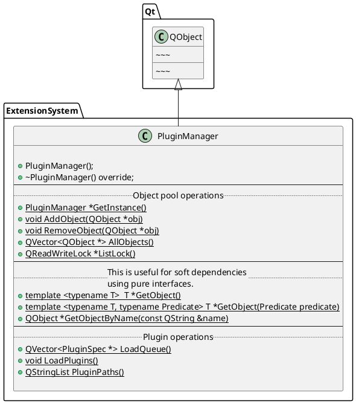

[TOC]
# 设计模式
## 一、面向对象设计原则

### 1、依赖倒置原则（DIP）
* 高层模块（稳定）不应该依赖于低层模块（变化），二者都应该依赖于抽象（稳定）。
* 抽象（稳定）不应该依赖于实现细节（变换），实现细节应该依赖于抽象（稳定）。

### 2、依赖倒置原则（OCP）
* 对扩展开发，对更改封闭。
* 类模块应该是可扩展的，但是不可修改。
 
### 3、单一职责原则（SRP）
* 一个类应该仅有一个引起它变化的原因。
* 变化的方向隐含着类的责任。

### 4、Liskov替换原则（KSP）
* 子类必须能够替换它们的基类（IS-A）。
* 继承表达类型抽象。

### 5、接口隔离原则（ISP）
* 不应该强迫客户程序依赖它们不用的方法。
* 接口应该小而完备。

### 6、优先使用对象组合，而不是类继承
* 类继承通常为“白箱复用”，对象组合通常为“黑箱复用”。
* 继承在某种程度上破环了封装性，子类父类耦合度高。
* 而对象组合则只要求被组合的对象具有良好定义的接口，耦合度低。

### 7、封装变化点
* 使用封装来创建对象之间的分界层，让设计者可以在分界层的一侧进行修改，而不会对另一侧产生不良的影响，从而实现层次间的松耦合。

### 8、针对接口编程，而不是针对实现编程
* 不将变量类型声明为某个特定的具体类，而是声明为某个接口。
* 客户程序无需获知对象的具体类型，只需要知道对象所具有的接口。
* 减少系统中各部分的依赖关系，从而实现“高内聚，低耦合”的类型设计方案。

## 二、模式分类

### 1、从目的来看：
* 创建型（Creational）模式：将对象的部分创建工作
* 结构型（Structural）模式：
* 行为型（Behavioral）模式：

### 2、从范围来看：
* 类模式处理类与子类的静态关系。
* 对象模式处理对象间的动态关系。

### 3、从封装变化角度对模式分类
a. 组件协作:
* Template Method
* Strategy
* Observer / Event

b. 单一职责：
* Decorator
* Bridge

c. 对象创建：
* Factory Method
* Abstract Factory
* Prototype
* Builder

d. 对象性能：
* Singleon
* Flyweight

e. 接口隔离：
* Facade
* Proxy
* Mediator
* Adapter

f. 状态变化：
* Memento
* Satae

g. 数据结构：
* Composite
* Iterator
* Chain of
* Responsibility

h. 行为变化：
* Command
* Visitor

i. 领域问题：
* Interpreter

### 4、重构的关键方法
* 静态 --> 动态
* 早绑定 --> 晚绑定
* 继承 --> 组合
* 编译时依赖 --> 运行时依赖
* 紧耦合 --> 松耦合


```plantumlcode
@startuml

@enduml
```
<center>


</center>

1. 插件框架 组织和管理系统插件的下载，装载，组合，实例化以及销毁
2. 插件契约 规定服务接口
3. 插件组件 具体的插件


扩展点
对象池

# 管理变化，提高复用